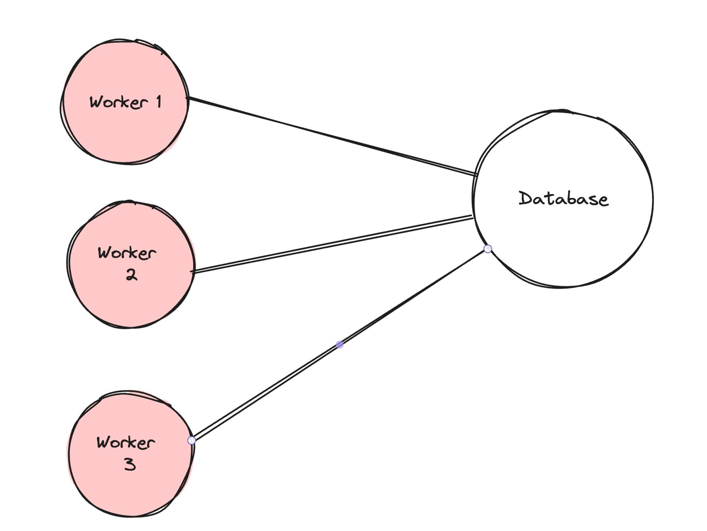
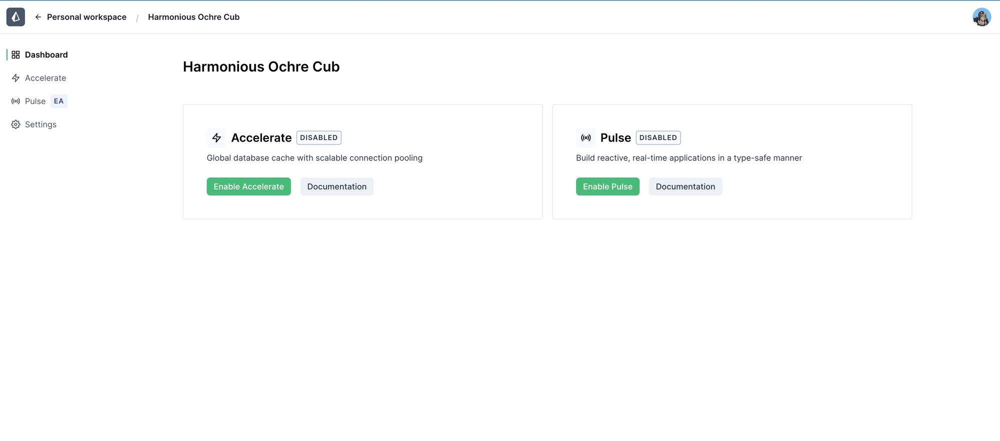
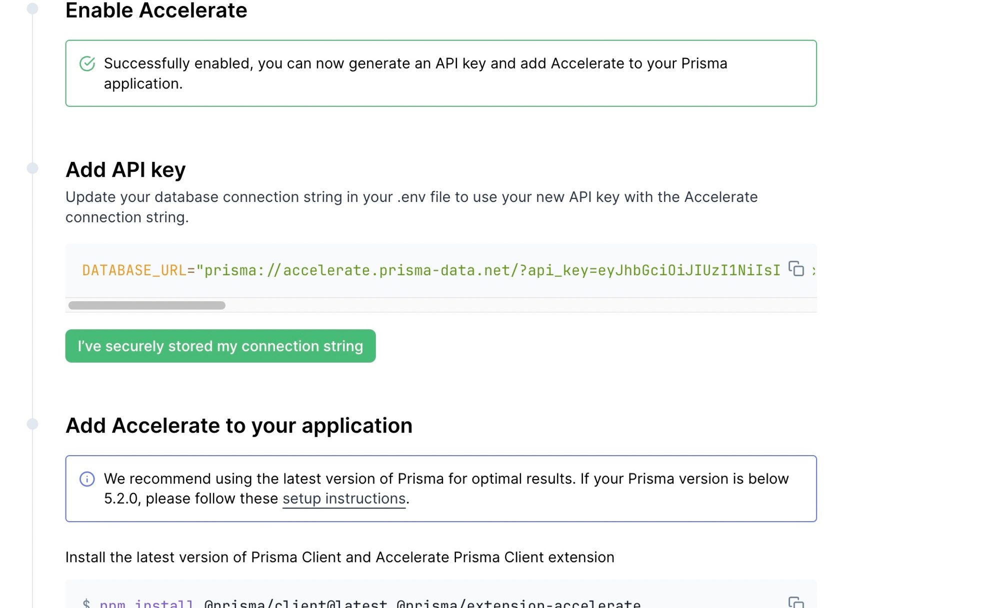

## Serverless Functions

Docs - https://www.prisma.io/docs/orm/prisma-client/deployment/edge/deploy-to-cloudflare

Serverless environments have one big problem when dealing with databases.

1. There can be many connections open to the DB since there can be multiple workers open in various regions



2. _Prisma_ the library has dependencies that the _cloudflare runtime_ doesn’t understand.

### Connection pooling in prisma for serverless env

- https://www.prisma.io/docs/accelerate
- https://www.prisma.io/docs/orm/prisma-client/deployment/edge/deploy-to-cloudflare-workers

### Process -

1.  Install prisma in your project

    **_`npm install --save-dev prisma`_**

2.  Init Prisma

    **_`npx prisma init`_**

3.  Create a basic schema

    ```
    generator client {
        provider = "prisma-client-js"
        }

    datasource db {
    provider = "postgresql"
    url = env("DATABASE_URL")
    }

    model User {
    id Int @id @default(autoincrement())
    name String
    email String
    password String
    }
    ```

4.  Create migrations

    `npx prisma migrate dev --name init`

5.  Signup to Prisma accelerate

    `https://console.prisma.io/login`

Enable accelerate



Generate an API key



Replace it in .env

    `DATABASE_URL="prisma://accelerate.prisma-data.net/?api_key=your_key"`

6.  Add accelerate as a dependency

    `npm install @prisma/extension-accelerate`

7.  Generate the prisma client

    `npx prisma generate --no-engine`

8.  Setup code

    ```
    import { Hono, Next } from 'hono'

    import { PrismaClient } from '@prisma/client/edge'
    import { withAccelerate } from '@prisma/extension-accelerate'
    import { env } from 'hono/adapter'

    const app = new Hono()

    app.post('/', async (c) => {
    // Todo add zod validation here
    const body: {
    name: string;
    email: string;
    password: string
    } = await c.req.json()
    const { DATABASE_URL } = env<{ DATABASE_URL: string }>(c)

    const prisma = new PrismaClient({
    datasourceUrl: DATABASE_URL,
    }).$extends(withAccelerate())

    console.log(body)

    await prisma.user.create({
    data: {
    name: body.name,
    email: body.email,
    password: body.password
    }
    })

    return c.json({msg: "as"})
    })

    export default app
    ```

### Setup Application -

https://www.prisma.io/docs/orm/prisma-client/deployment/edge/deploy-to-cloudflare#prerequisites

1. `npm create cloudflare@latest`

2. Install prisma as dev dependencies
   `npm install prisma --save-dev`

3. Initialize prisma
   `npx prisma init`

4. Make a model

   ```
   model log {
    id      Int    @id @default(autoincrement())
    level   String
    message String
    meta    Json
    }
   ```

5. Migrate
   `npx prisma migrate dev --name init`

   _it will show generated prisma client_

6. Now need to use - prisma Accelerate

**[Docs for - PRISMA ACCELERATE](https://www.prisma.io/docs/accelerate)** - managed connection pooler with global caching that helps speed up database queries. With Accelerate, you can easily configure connection pooling and choose the right cache strategy for your app.

Login ACCELERATE - [Getting started - ACCELERATE](https://www.prisma.io/docs/accelerate/getting-started)

- create new project
- enable accelerate
- generate string
- update DB connectiokn string under wrangler.toml (because it will provide environment things to serverless functions)
- install prisma accelerate extension
- generate prisma client with no engine (because we are doing with coudflare workers)
- 
